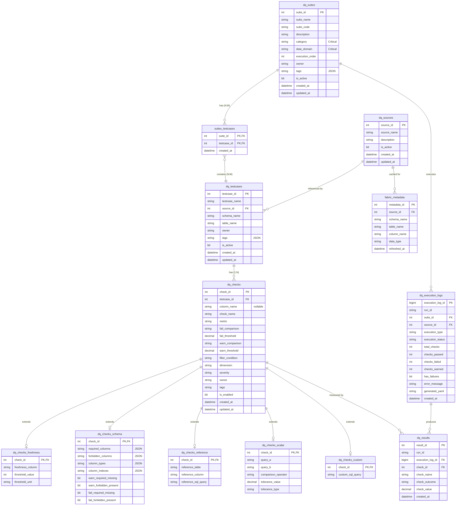

# DQ Checker Simplified ER Model

## Entity Relationship Diagram (Mermaid)



## ASCII Diagram

```
                                   BUSINESS METADATA
                              ┌─────────────────────────┐
                              │      dq_suites          │
                              │─────────────────────────│
                              │ suite_id (PK)           │
                              │ suite_name              │
                              │ suite_code              │
                              │ category      ← CRITICAL│
                              │ data_domain   ← CRITICAL│
                              │ execution_order         │
                              │ owner, tags, is_active  │
                              └───────────┬─────────────┘
                                          │
                                          │ N:M (via suites_testcases)
                                          │
                              ┌───────────┴─────────────┐
                              │   suites_testcases      │
                              │─────────────────────────│
                              │ suite_id (PK,FK)        │
                              │ testcase_id (PK,FK)     │
                              │ created_at              │
                              └───────────┬─────────────┘
                                          │
                                          │ N:M
                                          │
┌──────────────────┐          ┌───────────┴─────────────┐
│   dq_sources     │          │     dq_testcases        │  ← TABLE SCOPE
│──────────────────│   1:N    │─────────────────────────│
│ source_id (PK)   │◄─────────│ testcase_id (PK)        │
│ source_name      │          │ testcase_name           │
│ description      │          │ source_id (FK)          │
│ is_active        │          │ schema_name             │
└──────────────────┘          │ table_name              │
                              │ owner, tags, is_active  │
                              └───────────┬─────────────┘
                                          │
                                          │ 1:N
                                          │
                              ┌───────────┴─────────────┐
                              │      dq_checks          │  ← DQ RULES
                              │─────────────────────────│
                              │ check_id (PK)           │
                              │ testcase_id (FK)        │
                              │ column_name (nullable)  │
                              │ check_name, metric      │
                              │ fail/warn thresholds    │
                              │ dimension, severity     │
                              │ is_enabled              │
                              └───────────┬─────────────┘
                                          │
              ┌───────────────────────────┼───────────────────────────┐
              │              │            │            │              │
    ┌─────────┴────┐ ┌──────┴─────┐ ┌────┴─────┐ ┌────┴─────┐ ┌─────┴──────┐
    │  freshness   │ │   schema   │ │ reference│ │  scalar  │ │   custom   │
    │──────────────│ │────────────│ │──────────│ │──────────│ │────────────│
    │ check_id(FK) │ │ check_id   │ │ check_id │ │ check_id │ │ check_id   │
    │ column       │ │ req_cols   │ │ ref_table│ │ query_a  │ │ custom_sql │
    │ threshold    │ │ forb_cols  │ │ ref_col  │ │ query_b  │ │            │
    │ unit         │ │ col_types  │ │ sql_query│ │ operator │ │            │
    └──────────────┘ └────────────┘ └──────────┘ └──────────┘ └────────────┘
              EXTENSION TABLES (1:1 with dq_checks, ON DELETE CASCADE)
```

## Key Relationships

| Relationship | Type | Description |
|--------------|------|-------------|
| Suite → Testcase | **N:M** | Via `suites_testcases` link table. Same testcase can belong to multiple suites. |
| Testcase → Check | 1:N | Each testcase (table scope) has many checks |
| Check → Extension | 1:0..1 | Each check may have ONE extension table (based on metric type) |
| Source → Testcase | 1:N | Each data source has many testcases |

## What Changed from Legacy

| Entity | Change |
|--------|--------|
| `dq_suites` | **NEW** - Added business metadata fields (category, data_domain, execution_order) |
| `suites_testcases` | **KEPT** - N:M link table preserved for testcase reuse |
| `dq_testcases` | **MODIFIED** - Added schema_name, table_name (from Contract) |
| `dq_contracts` | **ELIMINATED** - Redundant 1:1 with testcase |
| `dq_checks` | **MODIFIED** - Removed source_id, schema_name, table_name (now on testcase) |

## Orphan Testcases

Testcases not linked to any suite are "orphans" (created via Quick Check):

```sql
-- View to find orphan testcases
CREATE VIEW vw_orphan_testcases AS
SELECT t.*
FROM dq_testcases t
WHERE NOT EXISTS (
    SELECT 1 FROM suites_testcases st WHERE st.testcase_id = t.testcase_id
);
```
