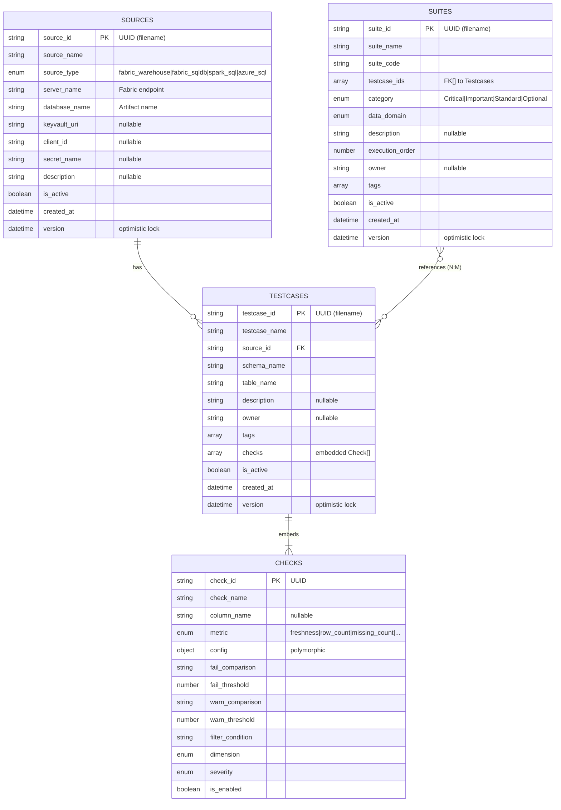

# DQ Checker JSON Data Model

## Overview

OneLake JSON storage architecture with load-all-cache-in-memory pattern.

**Key decisions:**
- 3 entities: Sources, Testcases (with embedded checks), Suites
- UUID as primary key (filename)
- No registry/catalog needed
- ~200 files, ~580KB total

---

## Entity Relationship Diagram (Mermaid)



---

## Storage Structure

```
Files/config/data/               ← JSON (frontend writes)
├── sources/                     # 3-5 files
│   └── {uuid}.json              # ~0.5KB each
├── testcases/                   # 80-140 files
│   └── {uuid}.json              # ~4KB each (with embedded checks)
└── suites/                      # 40-60 files
    └── {uuid}.json              # ~0.3KB each

Tables/                          ← Parquet (notebook writes)
├── dq_results/                  # Check outcomes
└── dq_execution_logs/           # Run metadata
```

---

## Relationships

```
Suite (40-60)
  └── testcase_ids[]: 3-10 references (N:M)
        │
        ▼
Testcase (80-140)
  ├── source_id: FK to Source (N:1)
  │     │
  │     ▼
  │   Source (3-5)
  │
  └── checks[]: 10-20 embedded checks (composition)
```

**Key relationships:**
- Suite → Testcase: **N:M** via `testcase_ids[]` array
- Testcase → Source: **N:1** via `source_id` FK
- Testcase → Check: **1:N composition** (embedded array)

---

## JSON Schemas

### sources/{uuid}.json

```json
{
  "source_id": "src-a1b2c3d4-e5f6-7890-abcd-ef1234567890",
  "source_name": "Production Warehouse",
  "source_type": "fabric_warehouse",
  "server_name": "xyz.datawarehouse.fabric.microsoft.com",
  "database_name": "SalesDB",
  "keyvault_uri": "https://myvault.vault.azure.net",
  "client_id": "xxx-xxx-xxx",
  "secret_name": "db-secret",
  "description": "Main production data warehouse",
  "is_active": true,
  "created_at": "2026-01-05T10:00:00Z",
  "version": "2026-01-05T10:30:00Z"
}
```

### testcases/{uuid}.json

```json
{
  "testcase_id": "tc-b2c3d4e5-f6g7-8901-bcde-f12345678901",
  "testcase_name": "Orders Table",
  "source_id": "src-a1b2c3d4-e5f6-7890-abcd-ef1234567890",
  "schema_name": "dbo",
  "table_name": "orders",
  "description": "Core orders table quality checks",
  "owner": "data-team@company.com",
  "tags": ["sales", "critical"],
  "checks": [
    {
      "check_id": "chk-001",
      "check_name": "Freshness check",
      "column_name": "updated_at",
      "metric": "freshness",
      "config": {
        "freshness_column": "updated_at",
        "threshold_value": 24,
        "threshold_unit": "hours"
      },
      "fail_comparison": ">",
      "fail_threshold": 48,
      "warn_comparison": ">",
      "warn_threshold": 24,
      "dimension": "timeliness",
      "severity": "critical",
      "is_enabled": true
    }
  ],
  "is_active": true,
  "created_at": "2026-01-05T10:00:00Z",
  "version": "2026-01-05T10:30:00Z"
}
```

### suites/{uuid}.json

```json
{
  "suite_id": "suite-g7h8i9j0-k1l2-3456-mnop-q12345678901",
  "suite_name": "Daily Quality Suite",
  "suite_code": "DQS-001",
  "testcase_ids": [
    "tc-b2c3d4e5-f6g7-8901-bcde-f12345678901",
    "tc-c3d4e5f6-g7h8-9012-cdef-g12345678902"
  ],
  "category": "Critical",
  "data_domain": "Sales",
  "description": "Daily quality checks for sales data",
  "execution_order": 1,
  "owner": "data-team@company.com",
  "tags": ["daily", "production"],
  "is_active": true,
  "created_at": "2026-01-05T10:00:00Z",
  "version": "2026-01-05T10:30:00Z"
}
```

---

## Polymorphic Check Configs

| Metric | Config Structure |
|--------|------------------|
| `freshness` | `{ freshness_column, threshold_value, threshold_unit }` |
| `schema` | `{ required_columns[], forbidden_columns[], column_types{} }` |
| `reference` | `{ reference_table, reference_column, reference_sql_query }` |
| `scalar` | `{ query_a, query_b, comparison_operator, tolerance }` |
| `custom_sql` | `{ custom_sql_query }` |
| `row_count`, `missing_*`, etc. | `{}` (empty config) |

---

## Data Flow

```
┌─────────────────────────────────────────────────────────────┐
│  APP START (~300ms one-time)                                │
│                                                             │
│  Load sources/     →  parallel read  →  memory (sources[])  │
│  Load testcases/   →  parallel read  →  memory (testcases[])│
│  Load suites/      →  parallel read  →  memory (suites[])   │
└─────────────────────────────────────────────────────────────┘
                           ↓
┌─────────────────────────────────────────────────────────────┐
│  AFTER LOAD: Everything instant from memory                 │
│                                                             │
│  Dropdowns     →  map over sources[]/testcases[]/suites[]   │
│  List views    →  filter/sort in memory                     │
│  Detail view   →  find by ID in memory                      │
│  Checks        →  already embedded in testcase              │
└─────────────────────────────────────────────────────────────┘
                           ↓
┌─────────────────────────────────────────────────────────────┐
│  MUTATIONS: Write-through pattern                           │
│                                                             │
│  1. Update memory (instant UI)                              │
│  2. Persist to OneLake (background)                         │
└─────────────────────────────────────────────────────────────┘
```

---

## Spark Integration

### External Tables (JSON config - read only)

```sql
CREATE EXTERNAL TABLE dq_sources USING JSON LOCATION 'Files/config/data/sources/';
CREATE EXTERNAL TABLE dq_testcases USING JSON LOCATION 'Files/config/data/testcases/';
CREATE EXTERNAL TABLE dq_suites USING JSON LOCATION 'Files/config/data/suites/';

-- Flattened checks view
CREATE VIEW vw_dq_checks AS
SELECT t.testcase_id, t.source_id, t.schema_name, t.table_name, c.*
FROM dq_testcases t
LATERAL VIEW explode(t.checks) AS c;
```

### Internal Tables (Parquet - notebook writes)

```sql
CREATE TABLE dq_execution_logs (...) USING PARQUET;
CREATE TABLE dq_results (...) USING PARQUET;
```

---

## Migration from SQL

| Old (SQL) | New (JSON) |
|-----------|------------|
| `dq_sources` table | `sources/*.json` |
| `dq_testcases` + `dq_checks` tables | `testcases/*.json` (embedded) |
| `suites_testcases` junction | `testcase_ids[]` in suite |
| `dq_checks_*` extension tables | `config{}` polymorphic object |
| `dq_execution_logs` | `Tables/dq_execution_logs/` (Parquet) |
| `dq_results` | `Tables/dq_results/` (Parquet) |

---

## Why This Architecture?

| Aspect | SQL/GraphQL | JSON/OneLake |
|--------|-------------|--------------|
| Cold start | 5-22 seconds | None |
| CRUD latency | 100-500ms | <100ms |
| CU cost | Per operation | Zero |
| Complexity | High (12 tables) | Low (3 entities) |
| Offline support | None | Possible |
